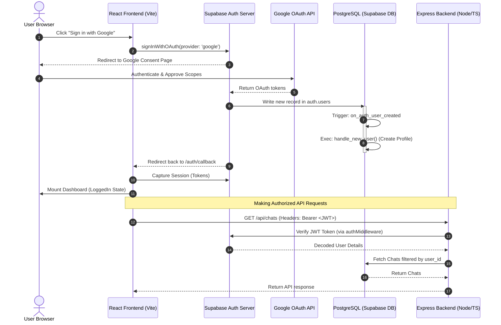

# FinX Authentication & Session Management Guide

Welcome to the comprehensive technical documentation for the authentication and authorization flows in FinX. This document is written assuming you have no prior knowledge of the project structure and explains every piece of the authentication puzzle in detail, from user sign-in down to database-level security policies.

---

## Table of Contents
1. **Overview & Technology Stack**
2. **End-to-End User Flow (Detailed Steps)**
3. **Frontend Authentication Architecture**
   - Supabase Client Configuration
   - The Custom `useAuth` React Hook
   - Authentication Event Subscription
4. **Database-Level Profiles & Auto-Provisioning**
   - Trigger Function: `handle_new_user()`
   - The `public.profiles` Table
5. **Backend JWT Validation & Request Enrichment**
   - Express Request Type Extensions
   - The `authMiddleware` Implementation
6. **Row-Level Security (RLS) & Tenant Isolation**
   - Why RLS is Necessary
   - RLS Policies Breakdown
7. **Security Best Practices & Critical Configurations**
8. **Troubleshooting Common Authentication Issues**

---

## 1. Overview & Technology Stack

FinX implements a hybrid authentication architecture. The frontend initiates the user session securely, while the backend verifies that session in a stateless, decentralized manner.

### Core Technologies
*   **Supabase Auth**: A managed user authentication service built on top of GoTrue. It handles OAuth logins, secure session storage (via cookies/localStorage), token refresh, and JSON Web Token (JWT) generation.
*   **Google OAuth 2.0**: The primary identity provider. Users log in with their Google accounts, allowing us to fetch their profile details and request offline API tokens for Google Drive integrations.
*   **JSON Web Tokens (JWT)**: Used for secure communication. The frontend receives an access token (JWT) from Supabase and sends it with every API request in the `Authorization` HTTP header.
*   **PostgreSQL Triggers**: Automatic SQL functions executed in the database to keep our local tables in sync with Supabase's internal auth engine.

---

## 2. End-to-End User Flow

The diagrams and descriptions below walk through what happens when a user clicks the "Sign in with Google" button.

### Flow Diagram



### Step-by-Step Explanation

1.  **Initiating Sign-In**: The user lands on the `LoginPage` and triggers the login flow. The frontend React application invokes the Supabase client library to request an OAuth login link.
2.  **Consent & Delegation**: The user is redirected to the Google Authentication page. Here, they grant permission for FinX to access their basic profile information, email address, and Google Drive access permissions.
3.  **Authentication Write**: Once the user logs in, Google hands back an authorization code to Supabase Auth. Supabase processes this code and inserts a new user record into the internal `auth.users` database table.
4.  **Automatic Profile Provisioning**: Immediately after a row is inserted in `auth.users`, a database trigger fires. This trigger executes the `handle_new_user()` function, which inserts a corresponding profile row in our custom `public.profiles` table with default values, guaranteeing that user metadata is always initialized.
5.  **Token Capture**: The user is redirected back to the `/auth/callback` page in the React frontend. The Supabase client parses the hash parameters in the URL, exchanges the payload for active session tokens, and saves them securely in the browser's storage.
6.  **JWT Verification on Requests**: When the user requests a resource (e.g., retrieving previous chat history), the frontend retrieves the JWT access token and attaches it to the request header as `Authorization: Bearer <token>`.
7.  **Decrypted Backend Verification**: The backend Express API interceptors capture the incoming token, call Supabase to verify its signature and expiration, extract the authenticated `userId`, and attach it directly to the Express request context (`req.userId`).
8.  **Database Return**: The database query is executed, filtering the returned data specifically to the authenticated user ID, keeping one tenant's files and conversations completely isolated from another's.

---

## 3. Frontend Authentication Architecture

The React frontend maintains authentication state globally and distributes it throughout the application via custom hooks.

### Supabase Client Configuration
The file `frontend/src/lib/supabase.ts` initializes the singleton client used for authentication and database calls:

```typescript
import { createClient } from '@supabase/supabase-js';

const supabaseUrl = import.meta.env.VITE_SUPABASE_URL;
const supabaseAnonKey = import.meta.env.VITE_SUPABASE_ANON_KEY;

if (!supabaseUrl || !supabaseAnonKey) {
  throw new Error('Missing Supabase environment variables in VITE configuration');
}

// Global Supabase client singleton instance
export const supabase = createClient(supabaseUrl, supabaseAnonKey);
```

### The Custom `useAuth` React Hook
Inside `frontend/src/hooks/useAuth.ts`, we encapsulate the login state, OAuth redirection, and sign-out logic:

```typescript
import { useEffect, useState, useCallback } from 'react';
import type { User } from '@supabase/supabase-js';
import { supabase } from '../lib/supabase';

interface AuthState {
  user: User | null;
  loading: boolean;
  error: string | null;
}

interface UseAuthReturn extends AuthState {
  signInWithGoogle: () => Promise<void>;
  signOut: () => Promise<void>;
}

export function useAuth(): UseAuthReturn {
  const [state, setState] = useState<AuthState>({
    user: null,
    loading: true,
    error: null,
  });

  useEffect(() => {
    // 1. Fetch the user session immediately when the hook mounts
    supabase.auth.getSession().then(({ data: { session } }) => {
      setState({ user: session?.user ?? null, loading: false, error: null });
    });

    // 2. Listen to real-time session updates (Token Refresh, Sign In, Sign Out)
    const {
      data: { subscription },
    } = supabase.auth.onAuthStateChange((_event, session) => {
      setState((prev) => ({
        ...prev,
        user: session?.user ?? null,
        loading: false,
      }));
    });

    // Clean up subscription when the component unmounts
    return () => subscription.unsubscribe();
  }, []);

  // Initiate Google OAuth login redirection
  const signInWithGoogle = useCallback(async () => {
    setState((prev) => ({ ...prev, loading: true, error: null }));
    const { error } = await supabase.auth.signInWithOAuth({
      provider: 'google',
      options: {
        redirectTo: `${window.location.origin}/auth/callback`,
        queryParams: {
          access_type: 'offline', // Demands a refresh_token from Google
          prompt: 'consent',     // Forces Google consent screen to ensure refresh_token is generated
        },
      },
    });
    if (error) {
      setState((prev) => ({ ...prev, loading: false, error: error.message }));
    }
  }, []);

  // Clear browser session and log user out
  const signOut = useCallback(async () => {
    setState((prev) => ({ ...prev, loading: true }));
    await supabase.auth.signOut();
    setState({ user: null, loading: false, error: null });
  }, []);

  return { ...state, signInWithGoogle, signOut };
}
```

#### Why we request `access_type: 'offline'` and `prompt: 'consent'`
In addition to user authentication, FinX connects to Google Drive on behalf of the user to ingest financial documents. To read from Google Drive in background processes (like the n8n webhook worker), the system needs to perform operations when the user is offline. Requesting `access_type: 'offline'` instructs Google to return a `refresh_token` alongside the standard access token. The `prompt: 'consent'` query parameter forces Google to show the authorization dialog even if the user has already authorized it, ensuring Google generates a fresh `refresh_token` on every reconnection.

---

## 4. Database-Level Profiles & Auto-Provisioning

When users sign in for the first time, their core user records are created inside the restricted schema of Supabase's internal database (`auth.users`). Since our API cannot directly mutate or easily query internal tables, we maintain a synchronized database table in our public schema: `public.profiles`.

### The `public.profiles` Table
This table has a 1-to-1 relationship with the authenticated user ID and contains application-specific fields:

```sql
CREATE TABLE IF NOT EXISTS public.profiles (
  id                   UUID PRIMARY KEY REFERENCES auth.users(id) ON DELETE CASCADE,
  email                TEXT,
  business_name        TEXT,
  google_refresh_token TEXT,        -- Contains Google API offline token (AES-256 encrypted)
  created_at           TIMESTAMPTZ  DEFAULT NOW()
);
```

### The Auto-Profile Trigger Function
Rather than writing backend logic to manually insert profiles (which is prone to race conditions or failures), we delegate this task to PostgreSQL. When a row is added to `auth.users`, a database trigger fires automatically.

Here is the migration script (`supabase/migrations/001_initial.sql`):

```sql
-- 1. Create a secure trigger function in the database
CREATE OR REPLACE FUNCTION public.handle_new_user()
RETURNS TRIGGER
LANGUAGE plpgsql
SECURITY DEFINER -- Runs with elevated permissions (to read auth metadata)
SET search_path = public
AS $$
BEGIN
  -- Insert a row into the public profiles table
  INSERT INTO public.profiles (id, email, business_name)
  VALUES (
    NEW.id,
    NEW.email,
    COALESCE(NEW.raw_user_meta_data->>'full_name', NEW.email) -- Use Google full name if available
  )
  ON CONFLICT (id) DO NOTHING;
  RETURN NEW;
END;
$$;

-- 2. Define the trigger binding to intercept users table insertions
CREATE OR REPLACE TRIGGER on_auth_user_created
  AFTER INSERT ON auth.users
  FOR EACH ROW
  EXECUTE FUNCTION public.handle_new_user();
```

---

## 5. Backend JWT Validation & Request Enrichment

All private backend routes are protected by a custom TypeScript middleware. This middleware interceptor intercepts client requests, extracts the JWT token, verifies it against the Supabase signing keys, and attaches the validated user ID to the request object.

### Express Request Type Extensions
To avoid TypeScript compilation issues when accessing the authenticated user ID inside custom routes, we extend the global Express interface in `backend/src/middleware/auth.ts`:

```typescript
declare global {
  namespace Express {
    interface Request {
      userId: string; // Adds a safe custom property to request objects
    }
  }
}
```

### The `authMiddleware` Implementation
The middleware uses the Supabase JavaScript library to parse and verify the signature of the incoming JWT. If the token is valid, control is handed over to the next route controller:

```typescript
import { Request, Response, NextFunction } from 'express';
import { createClient } from '@supabase/supabase-js';

let _supabaseAuth: ReturnType<typeof createClient> | null = null;

// Lazy initialization pattern for Supabase client
function getSupabaseAuth() {
  if (!_supabaseAuth) {
    if (!process.env.SUPABASE_URL || !process.env.SUPABASE_SERVICE_ROLE_KEY) {
      throw new Error('SUPABASE_URL and SUPABASE_SERVICE_ROLE_KEY must be set in .env');
    }
    _supabaseAuth = createClient(
      process.env.SUPABASE_URL,
      process.env.SUPABASE_SERVICE_ROLE_KEY
    );
  }
  return _supabaseAuth;
}

export async function authMiddleware(
  req: Request,
  res: Response,
  next: NextFunction
): Promise<void> {
  const authHeader = req.headers.authorization;

  // Validate the presence and structure of Authorization header
  if (!authHeader || !authHeader.startsWith('Bearer ')) {
    res.status(401).json({ error: 'Missing or malformed Authorization header' });
    return;
  }

  // Slice off the "Bearer " prefix to extract the raw JWT string
  const token = authHeader.slice(7);

  try {
    // Authenticate token against Supabase auth server
    const {
      data: { user },
      error,
    } = await getSupabaseAuth().auth.getUser(token);

    if (error || !user) {
      res.status(401).json({ error: 'Invalid or expired token' });
      return;
    }

    // Attach validated userID to request object
    req.userId = user.id;

    // Proceed to target route handler
    next();
  } catch (err) {
    console.error('[authMiddleware] Token verification failed:', err);
    res.status(401).json({ error: 'Authentication failed' });
  }
}
```

---

## 6. Row-Level Security (RLS) & Tenant Isolation

FinX is a multi-tenant B2B platform: multiple clients upload invoices, balance sheets, and tax reports. A leak where User A sees User B's documents would be catastrophic. 

While the backend ensures user queries are filtered, we enforce database-level boundaries. In PostgreSQL, this is done using **Row-Level Security (RLS)**.

### Why RLS is Necessary
By default, any database user (including the client connecting via the Supabase client SDK) can query any table. RLS acts as a firewall directly on the database table. Even if the application developer writes a query missing a `WHERE user_id = X` filter, PostgreSQL evaluates the authenticated Supabase user ID (`auth.uid()`) and automatically limits access.

### RLS Policies Breakdown

Here are the precise security constraints enforced on each table in `supabase/migrations/001_initial.sql`:

#### 1. Profiles Table Policies
Users must only view, create, or update their own workspace configurations:
```sql
CREATE POLICY "Users view own profile"
  ON public.profiles FOR SELECT
  USING (auth.uid() = id);

CREATE POLICY "Users update own profile"
  ON public.profiles FOR UPDATE
  USING (auth.uid() = id);

CREATE POLICY "Users insert own profile"
  ON public.profiles FOR INSERT
  WITH CHECK (auth.uid() = id);
```

#### 2. Documents Table Policies
Users can view the metadata of files synced in their vault:
```sql
CREATE POLICY "Users view own documents"
  ON public.documents FOR SELECT
  USING (auth.uid() = user_id);

CREATE POLICY "Users insert own documents"
  ON public.documents FOR INSERT
  WITH CHECK (auth.uid() = user_id);
```
> [!NOTE]
> There are no user-facing UPDATE or DELETE policies for documents. File processing updates, embedding indices, and document cleanup are managed asynchronously by the backend using a high-privilege `service_role` client. The service role bypasses RLS policies completely.

#### 3. Chats Table Policies
Conversations are strictly confidential and restricted to the user who created them:
```sql
CREATE POLICY "Users manage own chats"
  ON public.chats FOR ALL
  USING (auth.uid() = user_id)
  WITH CHECK (auth.uid() = user_id);
```

#### 4. Messages Table Policies
To read or write messages, the system must check the parent chat ownership. This prevents users from writing messages to chats that do not belong to them:
```sql
CREATE POLICY "Users view messages in own chats"
  ON public.messages FOR SELECT
  USING (
    EXISTS (
      SELECT 1 FROM public.chats
      WHERE chats.id = messages.chat_id
        AND chats.user_id = auth.uid()
    )
  );

CREATE POLICY "Users insert messages in own chats"
  ON public.messages FOR INSERT
  WITH CHECK (
    EXISTS (
      SELECT 1 FROM public.chats
      WHERE chats.id = messages.chat_id
        AND chats.user_id = auth.uid()
    )
  );
```

---

## 7. Security Best Practices & Critical Configurations

1.  **Environment Isolation**: Always separate VITE keys (`VITE_SUPABASE_URL`, `VITE_SUPABASE_ANON_KEY`) from backend key secrets. The backend service role key (`SUPABASE_SERVICE_ROLE_KEY`) has the power to bypass all RLS security policies. It **must never** be exposed in frontend source files or environment configurations.
2.  **JWT Validation Integrity**: The backend verifies JWTs by calling `auth.getUser(token)`. Never use `auth.decode()` or parse token payloads without verifying signatures. A decoded payload can be easily forged by attackers.
3.  **Token Refresh**: Supabase JWT tokens expire every 3600 seconds (1 hour). The frontend client handles token refreshes in the background. The backend relies on token headers being up-to-date. If requests fail after one hour of inactivity, ensure the frontend Axios request interceptor pulls the fresh session token before dispatching API calls.

---

## 8. Troubleshooting Common Authentication Issues

### Problem 1: Backend returns `401 Unauthorized - Missing or malformed Authorization header`
*   **Cause**: The frontend failed to attach the Bearer token to the Request Headers, or the token was omitted.
*   **Solution**: Check your Axios request interceptor (`frontend/src/lib/api.ts`). Ensure it retrieves the active session token using `supabase.auth.getSession()` and injects it into headers:
    ```typescript
    config.headers.Authorization = `Bearer ${session.access_token}`;
    ```

### Problem 2: User logs in but no profile record is created in `public.profiles`
*   **Cause**: The database trigger function failed. This usually occurs if the trigger SQL was modified, or if `handle_new_user()` failed to insert due to columns missing a default value.
*   **Solution**: Check the Postgres logs in Supabase. Run the following command in the SQL Editor to verify the triggers are active:
    ```sql
    SELECT trigger_name, event_manipulation, event_object_table, action_statement
    FROM information_schema.triggers;
    ```

### Problem 3: The error `auth.users does not exist` or compilation errors on migrations
*   **Cause**: Running raw migration scripts against local DBs without schema settings.
*   **Solution**: Ensure you are using `supabase db push` or executing migrations under the default database configurations. The `auth` schema is a system schema managed exclusively by Supabase; triggers must specify `SECURITY DEFINER` to bypass namespace separation when querying custom schemas.
