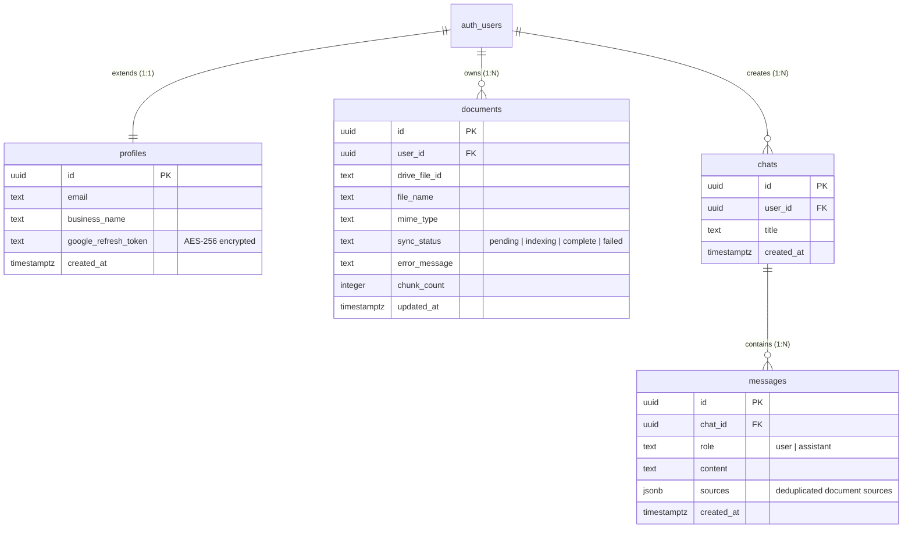

# FinX Relational Database Schema & Security Guide

This document details the database architecture of FinX. We use **PostgreSQL** hosted on **Supabase** to manage user profiles, document sync statuses, chat conversations, and messaging logs. This guide covers relational entities, custom SQL triggers, index structures, and Row-Level Security (RLS) policies that enforce strict tenant isolation.

---

## Table of Contents
1. **Overview & Schema Choices**
2. **Entity-Relationship Diagram (ERD)**
3. **Detailed Table Schemas & SQL Declarations**
   - User Profiles (`profiles`)
   - Document Sync Registry (`documents`)
   - Chat Sessions (`chats`)
   - Message Logs (`messages`)
4. **Performance Indexing Strategy**
5. **PostgreSQL Triggers & Automation**
   - Profile Creation Trigger: `handle_new_user()`
   - Modification Tracker Trigger: `update_updated_at_column()`
6. **Row-Level Security (RLS) Policies Deep Dive**
7. **Backend Database Access Layer (`backend/src/services/supabase.ts`)**
8. **Database Troubleshooting & Common Maintenance Tasks**

---

## 1. Overview & Schema Choices

FinX stores unstructured document text vectors inside the Pinecone vector database. However, structured metadata, conversational threads, user profiles, and sync logs are stored in a relational PostgreSQL database.

### Why Relational PostgreSQL on Supabase?
*   **Relational Integrity**: Deleting a user account automatically propagates (via cascades) to wipe their files, chats, and messages, preventing orphaned rows.
*   **JSONB Document Columns**: Message citations are stored in a flexible `JSONB` column, allowing the frontend to quickly render source file links without doing complex cross-table joins.
*   **Row-Level Security (RLS)**: Enforces access restrictions at the database engine level, acting as a security safeguard even if backend application code contains bugs.

---

## 2. Entity-Relationship Diagram (ERD)

Below is the database relationship structure. The database links user profiles, sync logs, and conversational contexts together.



---

## 3. Detailed Table Schemas & SQL Declarations

### A. User Profiles (`profiles`)
This table holds the application-level user details and encrypted authentication tokens for external services (Google Drive). It references Supabase's internal auth table `auth.users`.

```sql
CREATE TABLE IF NOT EXISTS public.profiles (
  id                   UUID PRIMARY KEY REFERENCES auth.users(id) ON DELETE CASCADE,
  email                TEXT,
  business_name        TEXT,
  google_refresh_token TEXT, -- AES-256 cipher text containing Google offline token
  created_at           TIMESTAMPTZ DEFAULT NOW()
);
```

### B. Document Sync Registry (`documents`)
Tracks document synchronizations from the Google Drive sandbox. Text vectors are kept in Pinecone, while this table stores search metadata, file statuses, and total chunk numbers.

```sql
CREATE TABLE IF NOT EXISTS public.documents (
  id             UUID PRIMARY KEY DEFAULT gen_random_uuid(),
  user_id        UUID NOT NULL REFERENCES auth.users(id) ON DELETE CASCADE,
  drive_file_id  TEXT NOT NULL,
  file_name      TEXT NOT NULL,
  mime_type      TEXT,
  sync_status    TEXT NOT NULL DEFAULT 'pending' 
                 CHECK (sync_status IN ('pending', 'indexing', 'complete', 'failed')),
  error_message  TEXT,
  chunk_count    INTEGER DEFAULT 0,
  updated_at     TIMESTAMPTZ DEFAULT NOW(),
  UNIQUE (user_id, drive_file_id) -- Prevents duplicate file index registers per user
);
```

### C. Chat Sessions (`chats`)
Represents individual messaging rooms.

```sql
CREATE TABLE IF NOT EXISTS public.chats (
  id         UUID PRIMARY KEY DEFAULT gen_random_uuid(),
  user_id    UUID NOT NULL REFERENCES auth.users(id) ON DELETE CASCADE,
  title      TEXT NOT NULL DEFAULT 'New Chat',
  created_at TIMESTAMPTZ DEFAULT NOW()
);
```

### D. Message Logs (`messages`)
Stores message contents in chat rooms. The `sources` column holds a list of citation items (`[{fileName, driveFileId, chunkId}]`).

```sql
CREATE TABLE IF NOT EXISTS public.messages (
  id         UUID PRIMARY KEY DEFAULT gen_random_uuid(),
  chat_id    UUID NOT NULL REFERENCES public.chats(id) ON DELETE CASCADE,
  role       TEXT NOT NULL CHECK (role IN ('user', 'assistant')),
  content    TEXT NOT NULL,
  sources    JSONB NOT NULL DEFAULT '[]'::JSONB,
  created_at TIMESTAMPTZ DEFAULT NOW()
);
```

---

## 4. Performance Indexing Strategy

To handle high volumes of messages and files without performance degradation, we establish indexes on columns used in `WHERE`, `ORDER BY`, and foreign key joins:

1.  **`idx_documents_user_id`**: Speed up queries loading the Document Vault list for a user, sorted by last modified date.
    ```sql
    CREATE INDEX IF NOT EXISTS idx_documents_user_id ON public.documents (user_id, updated_at DESC);
    ```
2.  **`idx_chats_user_id`**: Optimizes loading the history of chats in the left sidebar, sorted by creation date.
    ```sql
    CREATE INDEX IF NOT EXISTS idx_chats_user_id ON public.chats (user_id, created_at DESC);
    ```
3.  **`idx_messages_chat_id`**: Optimizes fetching full message logs when a chat is loaded, in chronological order.
    ```sql
    CREATE INDEX IF NOT EXISTS idx_messages_chat_id ON public.messages (chat_id, created_at ASC);
    ```

---

## 5. PostgreSQL Triggers & Automation

PostgreSQL triggers handle data integrity tasks automatically.

### Trigger 1: Profile Creation on Signup (`on_auth_user_created`)
Fires after an insert in `auth.users`. It extracts details from the Google OAuth user metadata to create a profile record in `public.profiles`.

```sql
CREATE OR REPLACE FUNCTION public.handle_new_user()
RETURNS TRIGGER
LANGUAGE plpgsql
SECURITY DEFINER -- Runs with high privileges to access user metadata
SET search_path = public
AS $$
BEGIN
  INSERT INTO public.profiles (id, email, business_name)
  VALUES (
    NEW.id,
    NEW.email,
    COALESCE(NEW.raw_user_meta_data->>'full_name', NEW.email)
  )
  ON CONFLICT (id) DO NOTHING;
  RETURN NEW;
END;
$$;

CREATE OR REPLACE TRIGGER on_auth_user_created
  AFTER INSERT ON auth.users
  FOR EACH ROW
  EXECUTE FUNCTION public.handle_new_user();
```

### Trigger 2: Auto-Update Modification Timestamp (`documents_updated_at`)
Triggers before an update in `public.documents`, updating `updated_at` to the current time.

```sql
CREATE OR REPLACE FUNCTION public.update_updated_at_column()
RETURNS TRIGGER
LANGUAGE plpgsql
AS $$
BEGIN
  NEW.updated_at = NOW();
  RETURN NEW;
END;
$$;

CREATE TRIGGER documents_updated_at
  BEFORE UPDATE ON public.documents
  FOR EACH ROW
  EXECUTE FUNCTION public.update_updated_at_column();
```

---

## 6. Row-Level Security (RLS) Policies Deep Dive

FinX implements Row-Level Security (RLS) to enforce tenant boundaries. 

### RLS Status Configuration
All four tables enforce RLS:
```sql
ALTER TABLE public.profiles  ENABLE ROW LEVEL SECURITY;
ALTER TABLE public.documents ENABLE ROW LEVEL SECURITY;
ALTER TABLE public.chats     ENABLE ROW LEVEL SECURITY;
ALTER TABLE public.messages  ENABLE ROW LEVEL SECURITY;
```

### The RLS Policies:
*   **`profiles`**: A user can query or modify profile rows only if the row ID matches their authenticated identifier (`auth.uid()`).
*   **`chats`**: Full access is granted only if `chats.user_id = auth.uid()`.
*   **`documents`**: Read-only access is checked: `documents.user_id = auth.uid()`.
*   **`messages`**: Users can view or post messages only if the parent chat belongs to them:
    ```sql
    CREATE POLICY "Users view messages in own chats"
      ON public.messages FOR SELECT
      USING (
        EXISTS (
          SELECT 1 FROM public.chats
          WHERE chats.id = messages.chat_id
            AND chats.user_id = auth.uid()
        )
      );
    ```

---

## 7. Backend Database Access Layer

In `backend/src/services/supabase.ts`, the backend connects to the database using a high-privilege **`service_role` client**. 

```typescript
export function getSupabaseAdmin(): SupabaseClient {
  if (!_adminClient) {
    if (!process.env.SUPABASE_URL || !process.env.SUPABASE_SERVICE_ROLE_KEY) {
      throw new Error('SUPABASE_URL and SUPABASE_SERVICE_ROLE_KEY must be set');
    }
    _adminClient = createClient(
      process.env.SUPABASE_URL,
      process.env.SUPABASE_SERVICE_ROLE_KEY,
      {
        auth: {
          autoRefreshToken: false,
          persistSession: false,
        },
      }
    );
  }
  return _adminClient;
}
```

### Why we use `service_role` on the Backend:
1.  **Bypassing RLS**: The background worker that updates file statuses (e.g., changing `sync_status` to `indexing` or `failed`) operates inside stateless worker pools. It needs to query and write across user boundaries.
2.  **No Client Session**: The webhook endpoint receives calls from n8n, which does not run inside a browser or have a user session. Using the service role allows safe writes on behalf of users.

---

## 8. Database Troubleshooting & Maintenance

### Problem 1: Cascading delete failed or records left behind
*   **Cause**: Foreign key relationships were set up without the `ON DELETE CASCADE` rule. If a user is deleted from `auth.users`, the child records inside `public.profiles` or `public.chats` will prevent deletion.
*   **Solution**: Ensure your migration file explicitly configures constraint cascades:
    ```sql
    ALTER TABLE public.chats 
    ADD CONSTRAINT chats_user_id_fkey 
    FOREIGN KEY (user_id) REFERENCES auth.users(id) ON DELETE CASCADE;
    ```

### Problem 2: RLS blocks backend service role updates
*   **Cause**: The backend is accidentally initialized with the client anonymous key (`SUPABASE_ANON_KEY`) instead of the service role key (`SUPABASE_SERVICE_ROLE_KEY`).
*   **Solution**: Check your backend `.env` variables. Ensure that the database client used in background workers is instantiated using `SUPABASE_SERVICE_ROLE_KEY`.

### Problem 3: JSONB source citation queries are slow
*   **Cause**: The JSON structure inside `messages.sources` has grown large, or the field is being queried with string operators instead of JSON operators.
*   **Solution**: Use the `->` or `->>` PostgreSQL JSON operators to search key values. For heavy search operations on JSON fields, establish a functional GIN index:
    ```sql
    CREATE INDEX idx_messages_sources_gin ON public.messages USING gin (sources);
    ```
