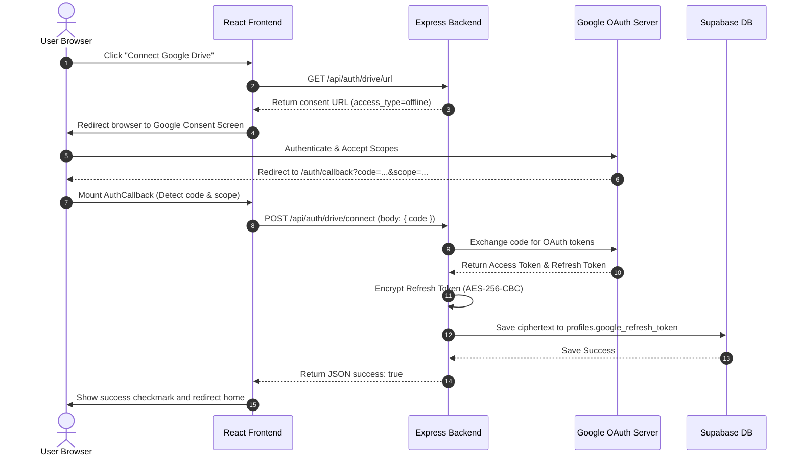

# FinX Google Drive Integration & Sync Guide

This document provides a highly detailed explanation of the Google Drive integration in FinX. Google Drive acts as the primary cloud storage vault for user documents. FinX watches this drive for updates, downloads files to extract their text, and indexes them in a vector database for natural language querying.

---

## Table of Contents
1. **Introduction & Architectural Role**
2. **The Google Drive OAuth 2.0 Integration Flow**
3. **Secure Token Storage: AES-256-CBC Encryption**
4. **Sandboxed Folder Management: "FinX Documents"**
5. **File Operations: Uploading and Downloading**
6. **Code Deep Dive: Core Files**
   - Google Drive Service (`backend/src/services/drive.ts`)
   - Express Router (`backend/src/routes/auth.ts`)
   - Callback page (`frontend/src/pages/AuthCallback.tsx`)
7. **Security Considerations & Best Practices**
8. **Troubleshooting & Common Failure Modes**

---

## 1. Introduction & Architectural Role

Rather than storing heavy files directly in our primary database (which is expensive and difficult to scale), FinX leverages **Google Drive** for user storage. 

This model provides several business and technical benefits:
*   **Zero Storage Overhead**: Users utilize their own Google Drive storage quotas.
*   **Convenience**: Business owners can drop invoices, statements, and tax sheets into their Google Drive from any device (phone, scanner, desktop) and immediately have them indexed by FinX.
*   **Security & Trust**: Financial documents remain inside the user's Google account rather than on third-party file servers.

To perform actions on behalf of the user, the backend requests offline, encrypted authorization tokens from Google.

---

## 2. The Google Drive OAuth 2.0 Integration Flow

Connecting Google Drive requires a distinct OAuth flow from the primary user signup. The user must grant consent to access their Google Drive scopes.

### OAuth Connection Lifecycle



### Authorization Callback Mechanics
The file `frontend/src/pages/AuthCallback.tsx` acts as the traffic controller for redirects. When Google redirects the user back, the URL contains search parameters:
*   `code`: The authorization code issued by Google.
*   `scope`: The scopes the user authorized.

Since our authentication callbacks for initial user signup and Google Drive both land on `/auth/callback`, the page checks the `scope` query parameter. If `scope` contains the word `drive`, the client recognizes this is a Google Drive setup callback:

```typescript
const params = new URLSearchParams(window.location.search);
const code = params.get('code');
const isFromDrive = params.get('scope')?.includes('drive') ?? false;

if (code && isFromDrive) {
  // Exchange code with the backend
}
```

---

## 3. Secure Token Storage: AES-256-CBC Encryption

A Google OAuth `access_token` is short-lived and expires in 60 minutes. To process documents in the background without forcing the user to log in again, we require the user's `refresh_token`. The refresh token can last indefinitely unless revoked.

Because the refresh token allows full access to the user's files within the requested scopes, it must **never** be stored in plain text.

### Encryption Implementation
We use Node.js's built-in `crypto` library to encrypt the refresh token using the standard **AES-256-CBC** algorithm before committing it to PostgreSQL.

```typescript
const IV_LENGTH = 16; // 16 bytes is the standard Initialization Vector length for AES

// Retrieve encryption key from environmental variables
function getEncryptionKey(): Buffer {
  const key = process.env.ENCRYPTION_KEY;
  if (!key) throw new Error('ENCRYPTION_KEY environment variable is not set');
  return Buffer.from(key, 'hex'); // Convert 64-character hex to 32-byte key buffer
}

// Encrypt plaintext token
export function encryptToken(plaintext: string): string {
  const iv = crypto.randomBytes(IV_LENGTH); // Generate unique IV for every token
  const cipher = crypto.createCipheriv('aes-256-cbc', getEncryptionKey(), iv);
  
  const encrypted = Buffer.concat([
    cipher.update(plaintext, 'utf8'), 
    cipher.final()
  ]);
  
  // Format as iv:ciphertext so we can read the IV on decryption
  return `${iv.toString('hex')}:${encrypted.toString('hex')}`;
}
```

### Decryption Implementation
When the background worker needs to call Google APIs, it decrypts the refresh token to configure the OAuth client credentials:

```typescript
export function decryptToken(ciphertext: string): string {
  // Split the iv and ciphertext components
  const [ivHex, encHex] = ciphertext.split(':');
  if (!ivHex || !encHex) throw new Error('Invalid encrypted token format');
  
  const iv = Buffer.from(ivHex, 'hex');
  const encrypted = Buffer.from(encHex, 'hex');
  
  const decipher = crypto.createDecipheriv('aes-256-cbc', getEncryptionKey(), iv);
  
  const decrypted = Buffer.concat([
    decipher.update(encrypted), 
    decipher.final()
  ]);
  
  return decrypted.toString('utf8');
}
```

---

## 4. Sandboxed Folder Management: "FinX Documents"

FinX is designed to operate only within a designated space inside a user's Google Drive. This sandboxing reduces our security footprint and prevents the system from scanning personal files.

We query or initialize a designated root folder named **`FinX Documents`** in the user's Drive.

```typescript
async function ensureFinXFolder(drive: ReturnType<typeof google.drive>): Promise<string> {
  // Search for an active, non-deleted folder named 'FinX Documents'
  const list = await drive.files.list({
    q: "name='FinX Documents' and mimeType='application/vnd.google-apps.folder' and trashed=false",
    fields: 'files(id)',
    spaces: 'drive',
  });

  // If found, return the existing folder ID
  if (list.data.files && list.data.files.length > 0) {
    return list.data.files[0].id!;
  }

  // Otherwise, create a new folder under the root drive
  const folder = await drive.files.create({
    requestBody: {
      name: 'FinX Documents',
      mimeType: 'application/vnd.google-apps.folder',
    },
    fields: 'id',
  });

  return folder.data.id!;
}
```

Whenever the frontend posts files directly to our system, we upload them into this folder. Similarly, the automation suite (n8n) monitors only this folder.

---

## 5. File Operations: Uploading and Downloading

### Downloading Files for Ingestion
During background processing, we must fetch the raw contents of a file to perform OCR or parse its text:

```typescript
export async function downloadDriveFile(
  userId: string,
  driveFileId: string
): Promise<DriveFileData> {
  const auth = await getAuthenticatedClient(userId);
  const drive = google.drive({ version: 'v3', auth });

  // 1. Fetch file metadata (filename and MIME type)
  const metaRes = await drive.files.get({
    fileId: driveFileId,
    fields: 'name,mimeType',
  });

  const fileName = metaRes.data.name ?? 'unknown';
  const mimeType = metaRes.data.mimeType ?? 'application/octet-stream';

  // 2. Download the binary stream
  const fileRes = await drive.files.get(
    { fileId: driveFileId, alt: 'media' }, // 'media' tells Google to return file contents instead of metadata
    { responseType: 'arraybuffer' }
  );

  return {
    buffer: Buffer.from(fileRes.data as ArrayBuffer),
    mimeType,
    fileName,
  };
}
```

### Uploading Files from Custom UI
If a user drags a file directly into the FinX Document Vault UI, the frontend makes a POST request to `/api/documents/upload`. The backend receives the file, pushes it to Google Drive under the `FinX Documents` folder, and Google Drive handles the cloud persistence.

```typescript
export async function uploadToDrive(
  userId: string,
  fileName: string,
  buffer: Buffer,
  mimeType: string
): Promise<string> {
  const auth = await getAuthenticatedClient(userId);
  const drive = google.drive({ version: 'v3', auth });

  // Ensure target folder is present
  const folderId = await ensureFinXFolder(drive);

  // Convert buffer to readable stream for the Google Client library
  const { Readable } = await import('stream');
  const readableStream = Readable.from(buffer);

  const res = await drive.files.create({
    requestBody: {
      name: fileName,
      parents: [folderId],
      mimeType,
    },
    media: {
      mimeType,
      body: readableStream,
    },
    fields: 'id',
  });

  if (!res.data.id) throw new Error('Drive upload did not return a file ID');
  return res.data.id;
}
```

---

## 6. Security Considerations & Best Practices

1.  **Scope Hardening**: We request two specific scopes:
    *   `drive.readonly`: Grants read access to files.
    *   `drive.file`: Grants the ability to write files and access folders created *specifically* by our app.
    These scopes prevent the app from modifying or deleting files outside of its domain.
2.  **Unique Encryption Key**: The encryption key (`ENCRYPTION_KEY`) must be exactly a **32-byte hex string** (64 hex characters) to satisfy `aes-256-cbc` requirements. If the key changes or is corrupted, all previously stored refresh tokens will fail to decrypt, rendering user connections invalid.
3.  **Strict Token Management**: Access tokens are kept in-memory inside the client object and never logged or written to storage. Only the encrypted refresh token is persisted in the database.

---

## 7. Troubleshooting & Common Failure Modes

### Problem 1: `No refresh token returned — ensure prompt=consent is set`
*   **Cause**: When a user authorizes Google Drive for the second time, Google defaults to a simplified confirmation. It omits the `refresh_token` because it assumes the application already stored it.
*   **Solution**: The auth redirection URL generated by the backend must always include the `prompt=consent` query parameter. This forces Google to show the full permissions prompt, guaranteeing that Google yields a new refresh token.

### Problem 2: Decryption fails with `bad decrypt` or `invalid key length`
*   **Cause**: The backend was restarted with a different `ENCRYPTION_KEY` in the `.env` configuration file, or the ciphertext saved in `profiles.google_refresh_token` was malformed or truncated.
*   **Solution**: Double-check that your `ENCRYPTION_KEY` is stable and has not changed. If you must reset the key, users will need to re-authenticate their Google Drive connection to overwrite their profile with the new encrypted token.

### Problem 3: File is deleted manually inside Google Drive
*   **Cause**: The user goes to their Google Drive account and deletes a file. The record in our database `public.documents` still displays the file as synced, but API calls fail when running chat queries.
*   **Solution**: Our system listens to Google Drive events via the `n8n` workflow engine webhook. If a file is deleted from Google Drive, the webhook receives a `deleted` event, updating our PostgreSQL state and removing the vector records in Pinecone. If n8n sync is interrupted, a manual re-sync trigger checks file existence and cleans up stale records.
