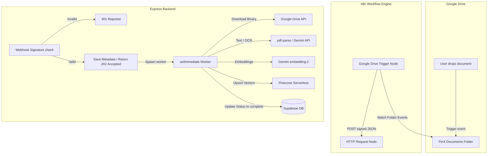

# FinX n8n Automation & Background Ingestion Guide

This document covers the automation and ingestion pipeline of FinX. It details how the **n8n Workflow Engine** coordinates with the Express backend to listen to Google Drive file changes, verify request authenticity, parse files using native tools or Gemini Multimodal OCR, chunk texts, calculate hybrid embeddings, and update search databases in the background.

---

## Table of Contents
1. **System Architecture Overview**
2. **Why n8n & Automated Ingestion?**
3. **Webhook Security: HMAC-SHA256 Signature Verification**
4. **Immediate Response Pattern (`202 Accepted` & `setImmediate`)**
5. **The Document Processing Pipeline**
   - Text Extraction (Native vs. Gemini OCR Fallback)
   - Text Chunking & Splitting Strategy
   - Hybrid Embeddings Generation (Dense + Sparse)
   - Vector Storage in Pinecone
6. **SQL Database Syncing**
7. **n8n Workflow Node Settings (Configuration Guide)**
8. **Troubleshooting & Common Failure Modes**

---

## 1. System Architecture Overview

When a user drops an invoice or bank statement into their synced Google Drive folder, FinX processes it asynchronously. The system flow coordinates across three environments:



---

## 2. Why n8n & Automated Ingestion?

A typical problem with document processing apps is performance overhead. Extracting text from a 20-page financial PDF, running OCR on scanned tables, creating embeddings, and uploading to vector databases can take anywhere from **5 to 45 seconds**. 

If done on the web server synchronously:
1.  The HTTP request remains open, leading to timeouts.
2.  Server resources are exhausted, slowing down the interface for other users.
3.  Any failure requires a full, slow re-upload.

**n8n** decouples file scanning from our app logic:
*   **Zero Polling Overhead**: n8n listens directly to Google Drive webhook channels. Our app does not need to poll Google Drive.
*   **Resiliency**: If our backend is temporarily down, n8n queues events and retries delivery.
*   **Stateless Processing**: The backend handles ingestion tasks independently inside background processes.

---

## 3. Webhook Security: HMAC-SHA256 Signature Verification

Because the `/api/ingest` endpoint is public and writes directly to our vector database, it must be protected. Standard headers are not enough. We verify the request payload using **HMAC-SHA256 signatures**.

Every request from n8n contains an `X-N8N-Signature` header. This header represents a cryptographic hash of the raw body payload, generated using a shared secret key (`N8N_WEBHOOK_SECRET`).

### HMAC Verification Middleware (`backend/src/middleware/webhookAuth.ts`)
The server reads the raw request buffer, signs it using the local secret, and compares it to the incoming header:

```typescript
import { Request, Response, NextFunction } from 'express';
import crypto from 'crypto';

export function webhookAuthMiddleware(
  req: Request,
  res: Response,
  next: NextFunction
): void {
  const secret = process.env.N8N_WEBHOOK_SECRET;

  // Development bypass helper
  if (!secret) {
    if (process.env.NODE_ENV === 'production') {
      res.status(500).json({ error: 'Webhook secret not configured' });
      return;
    }
    console.warn('[webhookAuth] ⚠️ N8N_WEBHOOK_SECRET not set — skipping verification (dev only)');
    next();
    return;
  }

  const signature = req.headers['x-n8n-signature'] as string | undefined;
  if (!signature) {
    res.status(401).json({ error: 'Missing X-N8N-Signature header' });
    return;
  }

  // 1. Gather raw request chunks
  const chunks: Buffer[] = [];
  req.on('data', (chunk: Buffer) => chunks.push(chunk));
  req.on('end', () => {
    const rawBody = Buffer.concat(chunks);

    // 2. Hash body using our local webhook secret key
    const expected = crypto
      .createHmac('sha256', secret)
      .update(rawBody)
      .digest('hex');

    const sigBuffer = Buffer.from(signature, 'hex');
    const expBuffer = Buffer.from(expected, 'hex');

    // 3. Constant-time comparison to prevent timing attacks
    if (
      sigBuffer.length !== expBuffer.length ||
      !crypto.timingSafeEqual(sigBuffer, expBuffer)
    ) {
      console.warn('[webhookAuth] Invalid signature — request rejected');
      res.status(401).json({ error: 'Invalid webhook signature' });
      return;
    }

    // 4. Parse JSON and attach to body for standard Express handlers
    try {
      req.body = JSON.parse(rawBody.toString('utf-8'));
    } catch {
      res.status(400).json({ error: 'Invalid JSON body' });
      return;
    }

    next();
  });
}
```

---

## 4. Immediate Response Pattern (`202 Accepted` & `setImmediate`)

When n8n forwards an event to our `/api/ingest` route, the route processes the payload, registers a placeholder document in Supabase with a `pending` status, and **immediately returns a response**.

```typescript
// 1. Save metadata in Supabase (Sync status defaults to 'pending')
const documentId = await createDocument({
  userId: user_id,
  driveFileId: drive_file_id,
  fileName: file_name,
  mimeType: mime_type,
});

// 2. Send 202 Accepted back to n8n immediately
res.json({
  success: true,
  action: event,
  documentId,
  fileName: file_name,
  status: 'indexing',
});

// 3. Queue the CPU-intensive work to execute in the next tick of the event loop
setImmediate(async () => {
  try {
    const { buffer, mimeType: actualMimeType } = await downloadDriveFile(user_id, drive_file_id);
    await ingestDocument({ ... });
  } catch (error) {
    // Error handling...
  }
});
```

Using `setImmediate()` allows Express to free up the request thread instantly. The n8n connection is closed successfully in under **50ms**, while the file download, text parsing, and vector embeddings execute in the background.

---

## 5. The Document Processing Pipeline

The background worker runs the full RAG (Retrieval-Augmented Generation) ingestion workflow.

### A. Text Extraction (Native vs. Gemini OCR Fallback)
Financial documents are notoriously complex. Some are native text PDFs, while others are photocopied scans or PNG screenshots of receipts. We apply a fallback strategy:

1.  **Image Files**: Automatically processed using Gemini's Vision API (`ocrDocument` using `gemini-3.5-flash`) for multimodal text recognition.
2.  **Native PDFs**: Standard text extraction is tried first using `pdf-parse`. If the text content is long enough (greater than `100` characters), we use the extracted text directly.
3.  **Scanned PDFs**: If `pdf-parse` fails or yields less than `100` characters, the system detects it is a scanned document and runs Gemini OCR on the pages to extract text verbatim.

### B. Text Chunking Strategy
Once raw text is loaded, it is split into pieces. We use LangChain's `RecursiveCharacterTextSplitter` configured for financial formats:
*   `CHUNK_SIZE`: **1000 characters**.
*   `CHUNK_OVERLAP`: **200 characters**.
*   `Separators`: `['\n\n', '\n', '. ', '! ', '? ', '; ', ', ', ' ', '']`.

This configuration keeps tables, paragraphs, and list indices intact while ensuring terms near chunk borders are present in adjacent blocks.

### C. Hybrid Embeddings Generation
FinX utilizes **hybrid vector searches**, combining semantic meaning with keyword scoring.
*   **Dense Vectors**: Batches of chunks are sent to the Gemini Embedding service (`gemini-embedding-2`) returning **768-dimensional dense vectors**.
*   **Sparse Vectors**: A local tokenizing algorithm hashes the text tokens, calculating term frequencies to output sparse coordinate vectors. This acts as a database-level BM25 search.

### D. Vector Storage in Pinecone
The dense and sparse values are consolidated into index records and upserted to Pinecone. 

```typescript
const records = chunks.map((chunk, i) => ({
  id: `${documentId}_chunk_${i}`,
  userId, // Used for tenant verification
  documentId,
  driveFileId,
  fileName,
  chunkIndex: i,
  text: chunk,
  denseValues: denseEmbeddings[i],
  sparseValues: sparseEmbeddings[i],
}));

await upsertVectors(records);
```

---

## 6. SQL Database Syncing

The ingestion state is tracked in the Supabase table `public.documents`:

| Status | Meaning |
| :--- | :--- |
| **`pending`** | Webhook request accepted, queued in the event loop. |
| **`indexing`** | File binary downloaded, running text parser and OCR engines. |
| **`complete`** | Vectors uploaded to Pinecone; file is ready to be queried in chats. |
| **`failed`** | An error occurred; the reason is logged in `error_message`. |

---

## 7. n8n Workflow Node Settings

To hook your local n8n instance into FinX, configure a workflow with the following nodes:

### Node 1: Google Drive Trigger (Polling/Webhook)
*   **Event**: `File Created or Updated` & `File Deleted`.
*   **Folder Filter**: Filtered to the `FinX Documents` folder.
*   **Outputs**: `id` (drive_file_id), `name` (file_name), `mimeType` (mime_type).

### Node 2: Set Variable Node
Maps output values to the payload contract:
*   `user_id` -> Custom user ID property (linked to profile ID).
*   `drive_file_id` -> `{{ $json.id }}`.
*   `file_name` -> `{{ $json.name }}`.
*   `mime_type` -> `{{ $json.mimeType }}`.
*   `event` -> `{{ $json.event }}` (created, updated, or deleted).

### Node 3: HTTP Request Node
*   **Method**: `POST`
*   **URL**: `https://<api-domain>/api/ingest`
*   **Authentication**: Custom Header
    *   Name: `X-N8N-Signature`
    *   Value: `{{ $hmac('sha256', $json, 'YOUR_WEBHOOK_SECRET') }}`
*   **Body**: JSON object.

---

## 8. Troubleshooting & Common Failure Modes

### Problem 1: Webhook fails with `Invalid webhook signature`
*   **Cause**: The secret key configured inside n8n's crypto node does not match the `N8N_WEBHOOK_SECRET` variable in the backend's `.env` file, or the payload body was mutated during transit.
*   **Solution**: Ensure both secret variables are identical. Confirm that no intermediate gateway (like Cloudflare or an API proxy) is modifying the JSON body spacing or sorting, as this changes the HMAC output.

### Problem 2: Document gets stuck in `indexing` status
*   **Cause**: The background worker failed silently, or the server crashed/restarted while processing.
*   **Solution**: Check your server logs. Look for Google API authentication errors or Gemini quota limit exhaustion. If the server crashes, locate the document row in Supabase and change `sync_status` back to `failed` to allow the user to trigger a manual sync.

### Problem 3: `Extracted text is too short` error on PDFs
*   **Cause**: The document is a PDF containing only images (like scanned business receipts) and the Gemini Multimodal OCR service timed out or was throttled.
*   **Solution**: Check that the Gemini API quotas are configured properly. For large files, verify that the backend server's timeout settings allow background processes sufficient time to communicate with external APIs.
