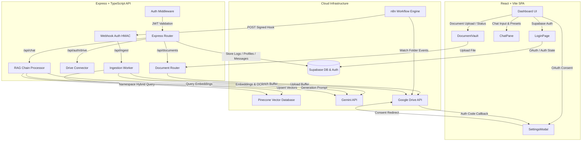

# FinX — Product Documentation & Technical Architecture Spec

FinX is a production-ready, secure B2B SaaS platform designed for Indian business owners to query, analyze, and gain insights from their financial and tax documents using AI. Users can upload GST returns, invoices, bank statements, legal agreements, and tax documents, then ask contextual questions to receive answers grounded strictly in their own data, complete with exact source citations and direct Google Drive file links.

---

## 1. System Architecture



---

## 2. Technical Stack

| Component | Technology | Role |
| :--- | :--- | :--- |
| **Frontend Framework** | React 18 + Vite | High-performance Single Page Application (SPA) |
| **Styling** | Tailwind CSS + Custom Dark Theme | Cyber-premium, high-contrast visual design |
| **Routing & State** | React Router DOM + Custom React Hooks | Client-side routing, modular Auth, Chat, and Document state |
| **Backend Framework** | Node.js + Express + TypeScript | Type-safe REST API server |
| **Database** | PostgreSQL (Supabase) | User profiles, chat history, messages, metadata, and RLS policies |
| **Auth Provider** | Supabase Auth (Google Sign-in) | Authentication, session persistence, and user security |
| **Vector DB** | Pinecone (Serverless) | Hybrid vector search (dense embeddings + sparse tokens) |
| **AI & LLM Services** | Gemini API (`gemini-3.5-flash`, `gemini-embedding-2`) | Dense embedding generation, FACT-grounded Q&A, and multimodal OCR |
| **Google Integration** | Google Drive API v3 | Long-term secure document storage |
| **Automation** | n8n Workflow Engine | File sync watcher; triggers background document ingestion |

---

## 3. Detailed System Flows

### A. Authentication & Sign-In Flow
1. **User Sign-in**: The user visits `LoginPage` and clicks **Sign in with Google**.
2. **Supabase Redirect**: The user is redirected to the Google Consent screen managed by Supabase.
3. **Session Verification**: After successful authentication, Google redirects back to `/auth/callback`.
4. **Auth State Hook**: The Supabase client automatically captures the session token, triggers the `SIGNED_IN` event in the frontend, and redirects the user to the main Dashboard.
5. **Auto-Profile Generation**: In the database, a PostgreSQL trigger fires on `auth.users` insertions, auto-creating a matching row in `public.profiles` with the user's name and email.

### B. Google Drive Connection & File Sync
1. **Consent Flow**: The user clicks **Connect Google Drive** inside the Settings Modal.
2. **Backend Redirect**: The frontend requests an OAuth URL from `/api/auth/drive/url`. The backend uses the Google OAuth2 client to generate a consent URL requesting the `drive.readonly` and `drive.file` scopes with `access_type: 'offline'` (forcing Google to supply a `refresh_token`).
3. **Authorization Callback**: Once the user accepts, Google redirects back to the frontend `/auth/callback` with a `code` query parameter and the `scope` parameter containing `drive`.
4. **Token Encryption & Storage**: The frontend detects this is a Drive callback and POSTs the code to `/api/auth/drive/connect`. The backend exchanges this code for Google API tokens, encrypts the `refresh_token` using `AES-256-CBC` (via the server's unique `ENCRYPTION_KEY`), and saves the ciphertext to the user's `profiles.google_refresh_token` in Supabase.
5. **Folder Initialization**: The backend automatically looks for or creates a specific folder named **`FinX Documents`** in the user's Google Drive. This acts as the synced sandbox folder.

### C. n8n Document Ingestion Flow
1. **Watcher**: n8n monitors the user's Google Drive for file events (`created`, `updated`, `deleted`).
2. **Webhook Trigger**: When an event occurs, n8n compiles the file details (user ID, drive file ID, filename, MIME type, event type) and sends a POST request to the backend `/api/ingest` endpoint.
3. **HMAC Protection**: The backend verifies the `X-N8N-Signature` header against the raw body using `HMAC-SHA256` and the shared `N8N_WEBHOOK_SECRET`.
4. **Immediate Response**: The backend upserts a document row in Supabase with a `pending` state and immediately returns a `202 Accepted` status to n8n to keep webhook execution short.
5. **Background Process**: The backend spawns an asynchronous worker using `setImmediate()` to complete ingestion:
   - **Download**: Fetches the file binary from Google Drive using the user's decrypted refresh token.
   - **Text Extraction**: Uses `pdf-parse` for standard PDFs. If the parsed text is shorter than 100 characters (or the file is an image), it falls back to Gemini Multimodal OCR (`gemini-3.5-flash`) to parse text verbatim.
   - **Chunking**: Splits text into 1,000-character chunks with 200-character overlaps using LangChain's `RecursiveCharacterTextSplitter`.
   - **Embeddings**: Batches chunk text and sends it to the Gemini API (`gemini-embedding-2`) to fetch 768-dimensional dense vector embeddings.
   - **Sparse Vector Encoding**: Processes the chunks using a custom token hashing function to build sparse frequency vectors (for BM25-like keyword scoring).
   - **Pinecone Upsert**: Batches and uploads the hybrid vectors into Pinecone under a namespace matching the user's UUID.
   - **Complete Status**: Updates the Supabase `documents` table row to `complete` and stores the total chunk count.

### D. Chat RAG Chain Flow
1. **Request**: The user submits a prompt, optionally selecting an active preset (Action Button).
2. **Auth Verification**: The server extracts and verifies the bearer JWT using the Supabase auth middleware.
3. **Message Storage**: Saves the user's message in the database `messages` table.
4. **Hybrid Retriever**: 
   - Generates a dense embedding for the user's query via Gemini.
   - Generates a sparse keyword representation of the query.
   - Executes a Pinecone hybrid search against the user's namespace, mixing dense and sparse scores with an alpha weight of `0.6` (optimized for financial terms like GST numbers, amount values, and dates).
   - Enforces strict tenant isolation with a mandatory filter: `user_id = userId`.
5. **Prompt Building**: Pulls the 10 most recent messages for conversational context, appends the retrieved document text chunks marked with `[Source X: filename]`, and adds custom system guidelines based on the active Action Button.
6. **Gemini Q&A**: Sends the grounded prompt to `gemini-3.5-flash` with a low temperature (`0.2`) to ensure factual accuracy and minimize hallucinations.
7. **Citations & Save**: Deduplicates the source chunks into citation structures containing the document ID, Google Drive link, and filename. Saves the assistant's answer and citations to Supabase, and returns them to the frontend.

---

## 4. Folder Structure & Key Files

```
FinX/
├── backend/                  # Node.js + Express API Server
│   ├── src/
│   │   ├── index.ts          # Server entrypoint and routing registry
│   │   ├── middleware/
│   │   │   ├── auth.ts       # JWT Validation from Supabase Client
│   │   │   └── webhookAuth.ts# HMAC Signatures validation for n8n
│   │   ├── routes/
│   │   │   ├── auth.ts       # Google Drive OAuth state & status
│   │   │   ├── chat.ts       # RAG chat logic, title generator
│   │   │   ├── chats.ts      # Chat history CRUD
│   │   │   ├── documents.ts  # Document registry list & upload
│   │   │   └── ingest.ts     # Webhook endpoint for n8n
│   │   ├── services/
│   │   │   ├── drive.ts      # Google Drive API wrappers & token encryption
│   │   │   ├── gemini.ts     # Gemini embeddings, generation, and OCR APIs
│   │   │   ├── pinecone.ts   # Pinecone index management, hybrid search queries
│   │   │   └── supabase.ts   # Database CRUD service wrappers
│   │   └── rag/
│   │       ├── chain.ts      # Orchestrates RAG flow
│   │       ├── ingest.ts     # Document parser (OCR / Text), Chunking, Vector creation
│   │       ├── prompts.ts    # Configured system instructions for financial analyses
│   │       └── retriever.ts  # Hybrid retriever orchestrator
│   └── package.json
│
├── frontend/                 # React Single Page App
│   ├── src/
│   │   ├── App.tsx           # Router and authentication layout
│   │   ├── main.tsx          # Client entry point
│   │   ├── index.css         # Custom animations and dark-theme Tailwind layer
│   │   ├── lib/
│   │   │   ├── api.ts        # Axios API wrapper with automated bearer tokens
│   │   │   └── supabase.ts   # Supabase client singleton configuration
│   │   ├── hooks/
│   │   │   ├── useAuth.tsx   # Accesses active user and logout functions
│   │   │   ├── useChat.tsx   # Conversation management hook
│   │   │   └── useDocuments.ts# Document synchronization and upload states
│   │   ├── pages/
│   │   │   ├── LoginPage.tsx # Beautiful glassmorphic sign-in page
│   │   │   ├── Dashboard.tsx # Main dashboard layout wrapper
│   │   │   └── AuthCallback.tsx# OAuth handler for Supabase and Google Drive callbacks
│   │   └── components/
│   │       ├── chat/
│   │       │   ├── ChatInput.tsx# Prompt input with action badges and neon-cyan glows
│   │       │   ├── ChatPane.tsx # Thread display, message bubbles, and dynamic indicators
│   │       │   ├── MessageBubble.tsx # Renders markdown messages, code blocks, and citations
│   │       │   └── ActionButtons.tsx # Customizable actions (RTI, GST, Tax checks)
│   │       └── layout/
│   │           ├── ThreeColumnLayout.tsx# Main dashboard grid layout
│   │           ├── LeftSidebar.tsx  # Conversation history sidebar
│   │           ├── DocumentVault.tsx# User file database, sync states, manual uploads
│   │           └── SettingsModal.tsx# Profile settings, Drive toggles, dark-themed tabs
│   └── package.json
│
├── shared/                   # Shared TypeScript contracts and types
│   └── types.ts
│
├── supabase/                 # Supabase Database Migrations
│   └── migrations/
│       └── 001_initial.sql   # Tables creation, constraints, indexes, triggers, and RLS
```

---

## 5. Database Schema & Row-Level Security (RLS)

All database tables are inside the `public` schema and enforce user-level isolation using **Row-Level Security** policies. Ingestion and delete routines bypass RLS using the Supabase `service_role` client.

```
+--------------------------------------------------------+
|                      profiles                          |
+--------------------------------------------------------+
| id                   | UUID PRIMARY KEY (auth.users)   |
| email                | TEXT                            |
| business_name        | TEXT                            |
| google_refresh_token | TEXT (AES-256 Ciphertext)       |
| created_at           | TIMESTAMPTZ DEFAULT NOW()       |
+--------------------------------------------------------+
                           | (1:1)
                           |
                           v (1:N)
+--------------------------------------------------------+
|                      documents                         |
+--------------------------------------------------------+
| id             | UUID PRIMARY KEY                      |
| user_id        | UUID NOT NULL (auth.users)            |
| drive_file_id  | TEXT NOT NULL                         |
| file_name      | TEXT NOT NULL                         |
| mime_type      | TEXT                                  |
| sync_status    | TEXT ('pending', 'indexing', ...)     |
| error_message  | TEXT NULL                             |
| chunk_count    | INTEGER DEFAULT 0                     |
| updated_at     | TIMESTAMPTZ DEFAULT NOW()             |
+--------------------------------------------------------+
                           | (1:N)
                           v
+--------------------------------------------------------+
|                        chats                           |
+--------------------------------------------------------+
| id         | UUID PRIMARY KEY                          |
| user_id    | UUID NOT NULL (auth.users)                |
| title      | TEXT DEFAULT 'New Chat'                   |
| created_at | TIMESTAMPTZ DEFAULT NOW()                 |
+--------------------------------------------------------+
                           | (1:N)
                           v
+--------------------------------------------------------+
|                      messages                          |
+--------------------------------------------------------+
| id         | UUID PRIMARY KEY                          |
| chat_id    | UUID NOT NULL (chats)                     |
| role       | TEXT ('user', 'assistant')                |
| content    | TEXT NOT NULL                             |
| sources    | JSONB DEFAULT '[]'::jsonb                 |
| created_at | TIMESTAMPTZ DEFAULT NOW()                 |
+--------------------------------------------------------+
```

### Key RLS Policies
- **`profiles`**: Select/Update/Insert are locked to `auth.uid() = id`.
- **`documents`**: Read-only via `auth.uid() = user_id`. Modification operations are done server-side via the service role client.
- **`chats`**: Full CRUD is locked to `auth.uid() = user_id`.
- **`messages`**: Users can view and insert messages if they own the parent chat (`EXISTS` query checks that `chats.user_id = auth.uid()`).

---

## 6. Tenant Isolation Guarantees

Tenant safety is maintained using two complementary layers of isolation inside Pinecone:
1. **Namespace Isolation**: All vectors belonging to user `X` are upserted and queried inside the Pinecone namespace `X`.
2. **Metadata Filters**: Every vector contains the metadata attribute `user_id: X`. The retriever enforces a filter `{ user_id: { $eq: userId } }` on all queries.

---

## 7. Custom AI Actions (Presets)

Users can activate action presets from the chat interface. These inject distinct structural directives into the system prompt:

- **Draft RTI Application**: Commands the LLM to draft a structured Right to Information application according to the RTI Act 2005. It automatically structures sections like *The Public Information Officer*, *Subject Matter*, *Description of Information Required*, and *Verification*.
- **GST Summary**: Commands the LLM to analyze GSTR invoices, summaries, and financial registers. It outputs GSTR-1 vs GSTR-3B audits, input tax credit (ITC) calculations, and tax liabilities with data tables.
- **Section 80C/80D Check**: Configures the LLM as an income tax specialist, auditing investment proofs (PPF, ELSS, Insurance premium, medical cards) and calculating deductibles against limits under Sections 80C and 80D.

---

## 8. Development Environment Configuration

Create a `.env` file in the root directory.

```properties
# Backend port & Node environment
PORT=3001
NODE_ENV=development

# Encryption key for Google OAuth refresh tokens (64-char hex string)
ENCRYPTION_KEY=1e7b45a6c8de2f34567890abcdef1234567890abcdef1234567890abcdef1234

# Google AI Studio API Key (Gemini)
GEMINI_API_KEY=AIzaSy...

# Pinecone credentials
PINECONE_API_KEY=pcsk_...
PINECONE_INDEX_NAME=finx-hybrid

# Google Cloud OAuth credentials (with Drive scope enabled)
GOOGLE_CLIENT_ID=1234567890-abcdef.apps.googleusercontent.com
GOOGLE_CLIENT_SECRET=GOCSPX-...
GOOGLE_REDIRECT_URI=http://localhost:5173/auth/callback

# Supabase database URLs & keys
SUPABASE_URL=https://xxxxxxxxxxxxxxxxxxxx.supabase.co
SUPABASE_SERVICE_ROLE_KEY=eyJhbGciOi... # Bypasses RLS for ingestion
SUPABASE_JWT_SECRET=super-secret-...    # Decodes frontend tokens

# n8n Integration
N8N_WEBHOOK_SECRET=my_shared_webhook_secret_key
```
