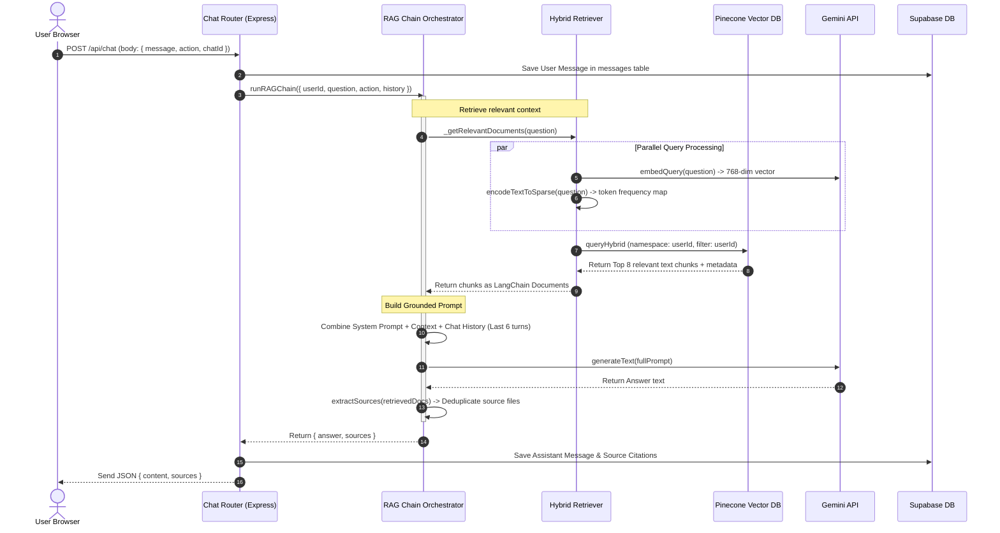

# FinX RAG Chat Engine Architecture Guide

This document explains the core intelligence layer of FinX: the **RAG (Retrieval-Augmented Generation) Chat Engine**. This engine allows users to query complex financial and tax documents in natural language and receive grounded, accurate answers containing data tables and direct citations back to their source files.

---

## Table of Contents
1. **Introduction to RAG in FinX**
2. **End-to-End Chat Pipeline Execution Flow**
3. **The Hybrid Retriever (Dense vs. Sparse Search)**
4. **Tenant Isolation Safeguards in Search**
5. **System Prompt Formulation & Grounding Rules**
6. **Action Presets (Custom AI Agents)**
   - Draft RTI Application
   - GST Summary Auditor
   - Section 80C/80D Deduction Checker
7. **LLM Title Generation Engine**
8. **Code deep Dive: Key Modules**
   - RAG Chain Orchestrator (`backend/src/rag/chain.ts`)
   - Custom Hybrid Retriever (`backend/src/rag/retriever.ts`)
   - System Prompt Definitions (`backend/src/rag/prompts.ts`)
9. **Troubleshooting & Common Failure Modes**

---

## 1. Introduction to RAG in FinX

Large Language Models (LLMs) like Gemini are highly capable but suffer from two major limitations in financial domains:
1.  **Lack of Private Data**: They have no knowledge of a user's private invoices, receipts, or GSTR returns.
2.  **Hallucinations**: They may generate convincing but factually incorrect figures, dates, or calculations.

**Retrieval-Augmented Generation (RAG)** solves both problems:
*   Instead of letting the model guess, we look up relevant sections (text chunks) from the user's uploaded documents that match their question.
*   We feed those specific text chunks directly into the prompt as the **"Context"**.
*   We instruct the LLM to write the response **strictly using only that context**. If the answer is not in the context, the model states that it cannot find the information.

---

## 2. End-to-End Chat Pipeline Execution Flow

When a user types a question like *"What was the SGST paid on Invoice #55?"*, the system runs the following pipeline:



---

## 3. The Hybrid Retriever (Dense vs. Sparse Search)

Standard vector databases search using cosine similarity on high-dimensional embeddings (dense search). While dense search is excellent at finding conceptual matches (e.g., matching *"health expenses"* to *"medical insurance receipt"*), it can struggle with exact keyword matching.

In financial auditing, exact terms are critical. A user searching for a specific GST registration number (`27AAAAA1111A1Z1`) or a precise transaction value (`₹1,24,500`) needs exact matching, not a conceptual approximation.

FinX uses a **Hybrid Retriever** to solve this:
*   **Dense Representation**: The question is sent to the Gemini Embedding service (`gemini-embedding-2`) yielding a **768-dimensional dense vector** representing semantic concepts.
*   **Sparse Representation**: The question is tokenized locally into a frequency dictionary (BM25 keyword matches) representing exact term occurrences.
*   **Alpha Weight Blending**: We query Pinecone using a blend ratio (alpha) of **`0.6`**:
    $$\text{Score} = 0.6 \times \text{Dense Score} + 0.4 \times \text{Sparse Score}$$
    This ratio is optimized to weight semantic intent slightly higher while giving significant boost to exact alphanumeric matches.

---

## 4. Tenant Isolation Safeguards in Search

FinX enforces multi-tenancy at the search layer. Because all users' document vectors are stored in the same index, we use a two-step safeguard:

1.  **Namespace Partitioning**: All vectors are upserted into, and queried from, a Pinecone namespace named after the user's UUID.
2.  **Hard Filtering**: Every query includes a strict metadata filter:
    ```json
    { "user_id": { "$eq": "user-uuid-here" } }
    ```
    Even if Pinecone fails to isolate the namespace, the filter guarantees that a query can never match a vector belonging to another user.

---

## 5. System Prompt Formulation & Grounding Rules

Our prompts are designed to prevent the model from answering questions using its own pre-trained knowledge. The file `backend/src/rag/prompts.ts` defines these strict rules.

### Grounding Rules Enforced:
1.  **Context-Only Rule**: The model must only answer using the provided context. If the information is not in the context, it must reply with: *"I don't have sufficient information in your uploaded documents to answer this. Please upload the relevant documents and try again."*
2.  **Precision Citing**: Always quote exact figures, invoice numbers, and dates.
3.  **Currency Uniformity**: Format all amounts using the Indian Rupee symbol (`₹`) and standard comma spacing (e.g., `₹10,50,000`).
4.  **Tone Check**: Maintain an objective, professional tone without speculation or extrapolation.

---

## 6. Action Presets (Custom AI Agents)

Users can activate action presets from the UI to change the system prompt rules for specialized tasks.

### Preset A: Draft RTI Application (`draft_rti`)
Instructs the model to write a formal Right to Information (RTI) application following the RTI Act 2005. It automatically formats the Public Authority name, applicant details, period of information sought, specific questions, and the standard ₹10 fee payment declaration.

### Preset B: GST Summary Auditor (`gst_summary`)
Directs the model to parse GSTR forms or sales registers, summarizing outward tax liabilities and input tax credit (ITC) availabilities. It outputs data tables containing CGST, SGST, IGST, and net liabilities.

### Preset C: Section 80C/80D Deduction Checker (`tax_deductions`)
Configures the model as a tax auditor. It parses investment receipts (PPF, ELSS, insurance) and health checks, organizing them in a summary table showing limits and eligible tax deduction amounts.

---

## 7. LLM Title Generation Engine

When a conversation is started, the application needs a title. Rather than naming it "Chat 12", the backend prompts Gemini to generate a concise, context-aware title from the first message:

```typescript
export async function generateChatTitle(firstMessage: string): Promise<string> {
  const prompt = `Generate a concise 4-6 word title for a financial chat conversation that starts with this message: "${firstMessage.slice(0, 200)}"
  
Requirements:
- Maximum 6 words
- Descriptive and specific
- No quotes or punctuation at the end
- Examples: "GST March Quarter Analysis", "Section 80C Deductions Check", "RTI Application for Land Records"

Title:`;

  try {
    const title = await generateText(prompt);
    return title.trim().slice(0, 80); // Cap at 80 characters for database safety
  } catch {
    return firstMessage.slice(0, 50).trim() + '...'; // Truncation fallback
  }
}
```

---

## 8. Troubleshooting & Common Failure Modes

### Problem 1: The model answers questions using general knowledge instead of uploaded documents
*   **Cause**: The prompt grounding instructions were ignored, or the context was empty because the retriever failed to find matches.
*   **Solution**: Check the backend logs to confirm if `Retrieved X chunks` returns `0`. If retrieval works but the model still hallucinates, tighten the system prompt to explicitly state: *"Under no circumstances should you mention facts or figures not listed in the context below."*

### Problem 2: Currency formatting or citation numbers are inconsistent
*   **Cause**: The LLM output temperature was set too high, leading to more creative and less rule-compliant text outputs.
*   **Solution**: Ensure the generation call in `backend/src/services/gemini.ts` passes a low temperature setting (e.g., `0.1` or `0.2`) to force rule compliance:
    ```typescript
    const result = await model.generateContent({
      contents: [{ role: 'user', parts: [{ text: prompt }] }],
      generationConfig: { temperature: 0.2 }
    });
    ```

### Problem 3: A conversation has multiple files uploaded, but the retriever only pulls from one
*   **Cause**: The `topK` retrieval value is set too low (e.g., `3` chunks), or the search query is dominated by terminology unique to a single document.
*   **Solution**: Adjust the `topK` value in the `HybridPineconeRetriever` options to retrieve a larger pool of candidate chunks (e.g., `8` to `12` chunks). This allows the context to contain relevant snippets across multiple files.
